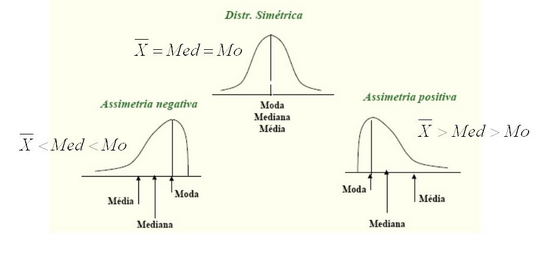
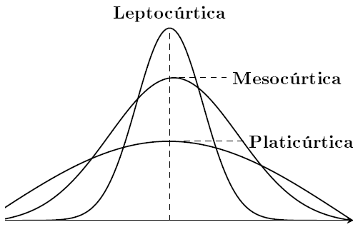

```{r,setup, include=FALSE}
knitr::opts_chunk$set(comment = NULL,
               message = FALSE)
library(knitrBootstrap)
```

Geralmente a análises descritivas são as primeiras manipulações realizadas em um estudo
quantitativo e tem como principal objetivo resumir, sumarizar e explorar o comportamento dos
dados. Isso pode ser feito através de tabelas de frequências, gráficos e medidas de resumo
numérico.
Antes de apresentarmos cada um desses ítens, primeiro vamos identificar os tipos
de variáveis que podemos encontrar em nossos dados.
  
>TABELA 1 – Variável Qualitativa

|Tipo         | Descrição                                   |Exemplo                                 |
|-------------| --------------------------------------------|----------------------------------------|
|Nominal      | São categorias que não podem ser ordenadas  |Estado de saúde de um paciente (saudável ou doente)          |  
|Ordinal      | São categorias que seguem uma ordem natural |Intensidade de um maratonista (leve, moderada ou forte)           |
|             |                                             |                                        |   

>TABELA 2 – Variável Quantitativa

|Tipo         | Descrição                                   |Exemplo                                 |
|-------------| --------------------------------------------|----------------------------------------|
|Discreta     | Seu campo de variação é um conjunto finito ou infinito enumerável, em geral são contagens  |Número de ovos de um mosquito encontrados em uma região    |  
|Continua     | Seu campo de variação é um conjunto infinito não-enumerável |Peso e altura de pacientes de um hospital   |
|             |                                             |                                        |   

Além disso é importante citar algumas variáveis comumente encontradas que podem receber ambas as classificações definidas acima. Elas podem ser vistas como transformações de variáveis.

**1. Rank/Posto**

Rank pode ser definido como o número que corresponde a posição de cada observação de uma amostra de valores. Os dados são ordenados de forma crescente (ou descrescente) e recebem um rank ou posto com base nessa ordenação. Quando há um empate, ou seja, valores iguais, devem ter postos iguais. Uma maneira encontrada para solucionar tais problemas é considerar, para os casos em que haja empates, a média dos postos. Esse tipo de rank é muito utilizado em alguns testes estatísticos não-paramétricos que serão definidos mais a frente. Abaixo um exemplo com um vetor de 5 valores de uma distribuição Poison(Será definido na seção de Probabilidade), no R usamos a função`rank()`, para calcular os postos de uma amostra.

```{r}
## Gerando um vetor aleatório com cinco valores de uma ditribuição Poison
x<-rpois(5,1)
x
rank(x)
```

Causas de mortes de uma região ordenadas pela magnitude de mortandade


**2. Porcentagem**

Porcentagem também pode ser chamada de proporção ou frequência relativa simples. É a proporção de indivíduos pertencentes a uma categoria e o número total de indivíduos considerados na amostra. Então ela é expressa mais comumente em percentagem. Exemplo pode ser a expressão do número de óbitos por acidentes de trânsito por faixa etária em um região divido pelo total de óbitos por acidentes de trânsito.


**3. Taxas**

A taxa pode ser vista como o número de casos de um resultado de interesse que ocorre em um determinado período de tempo dividido pelo tamanho da população nesse período. Quando se calcula uma taxa está implícita sempre a noção de risco de acontecimento do fenômeno em estudo. Assim, uma taxa  é sempre calculada para determinado período de tempo bem especificado e para uma área delimitada. Um exemplo para cálculo de taxa pode ser o coeficiente geral de mortalidade que seria a razão entre o número total de óbitos de uma determinada região em um determinado período de tempo dividido  pela população total desta região no mesmo período de tempo.

**4. Escores**

Escore é uma pontuação dadas aos indivíduos de uma amostra para mensuar determinado risco ou chance que ocorrer um determinado evento de interesse. Dado o escore ou a pontuação as observações podem ser alocadas em determinadas faixas de classificação que são determinadas por alguma metodologia estatística. Um exemplo é o atendimento em um pronto socorro que após algumas informações serem coletadas, cada índivíduo recebe um escore segundo um modelo estatístico ou outra metodologia matemática e desta forma seu atendimento é classificado como urgente, pouco urgente ou sem urgência.

**5. Variáveis latentes**

São variáveis não observáveis ou que não podem ser medidas diretamente. Desta forma são criadas escalas para poder mensurá-las. A área da estatśtica de trata disso se chama psicometria, disciplina que é ofertada anualmente no mestrado de Bioestatística da UEM <http://www.pbe.uem.br/wp-content/uploads/2013/05/DES4057-Psicometria-usando-Mplus.pdf>. Um exemplo podem ser as variáveis que representam sentimentos como felicidade ou depressão que podem ser medidas através de instrumentos analíticos psicológicos. Um outro exemplo clássico de variável latente é o erro que um modelo de regressão comete, não pode ser mensurado mas estimado através dos resíduos (Modelo de Regressão será visto mais adiante).

## Tabelas de frequência

As tabelas de frequências são ideais para resumir variáveis qualitativas e quantitativas
discreta desde que esta última tenha um conjunto pequeno de valores diferentes. Se não for o caso,
o recomendado é a criação de faixas de valores ou intervalos de classe e isso vale também para
variável quantitativa contínua. Basicamente o que se dispõe nas tabelas de frequências são a
frequência absoluta, frequência relativa e, em alguns casos quando for o interesse, a frequência acumulada, tanto absoluta quanto relativa.
Veja o exemplo na Tabela 3, utilizando uma amostra de 132 alunos de uma turma da graduação em psicologia
de uma Universidade no Paraná em 2015, as frequências acerca do uso de derivados de tabaco e outras substâncias.

>TABELA 3 – Frequência do Uso de Derivados do Tabaco e Outras Substâncias

|Substância              | Frequência Absoluta |Frequência Relativa(%) |
|------------------------| --------------------|-----------------------|
|**Derivados do Tabaco** |                     |                       |
|   Sim                  |57                   |43,18                  |
|   Não                  |75                   |56,82                  |
|**Bebidas Alcoólicas**  |                     |                       |
|   Sim                  |109                  |82,58                  |
|   Não                  |23                   |17,42                  |
|**Maconha**             |                     |                       |
|   Sim                  |36                   |27,27                  |
|   Não                  |96                   |72,73                  |
|**Cocaína/Crack**       |                     |                       |
|   Sim                  |7                    |5,30                   |
|   Não                  |125                  |94,70                  |
|**Outras Substâncias**  |                     |                       |
|   Sim                  |21                   |15,91                  |
|   Não                  |111                  |84,09                  |
|                        |                     |                       |  

Notamos que a maioria dos alunos desta universidade consomem bebidas alcoólicas quando observamos a coluna Frequência Relativa que é contruída da seguinte maneira:

$n_i$:frequência da classe

$n$:frequência total

$f_i = \frac{n_i}{n}*100$

Para a classe Bebidas Alcólicas a conta seria:
```{r}
(109/132)*100
```
## Gráficos

Os gráficos são uteis para representação do comportamento da variável em estudo. Eles
podem facilitar a interpretação com relação as tabelas. Porém deve se ter cuidado ao optar por esta
visualização para que não induza o leitor a interpretações equivocadas. Portanto existe
gráficos adequados para cada tipo de variável, ela podendo ser qualitativa ou quantitativa.
Com base nas classificações de variáveis descritas nas Tabelas 1 e 2, o próximo passo
é identificar qual gráfico será o adequado.
Há vários tipos de gráficos para representar variáveis qualitativas. Os mais usados são os
gráficos de composição de setores e de barras.
Os gráficos de setores são adequados para representar variáveis qualitativas nominais. Sua
construção é simplesmente a repartição de um disco, que informalmente é chamado de pizza, em
setores cujos tamanhos são proporcionais as frequências relativas de cada categoria da variável
nominal. 

Abaixo temos um exemplo sobre este gráfico. Ele foi gerado com dados sobre mortalidade infantil neonatal em Curitiba-PR em 2004. Vamos representar a variável tipo de gestação da mãe.

```{r}
# Carregando os dados
dados<-read.table('http://leg.ufpr.br/lib/exe/fetch.php/projetos:neo_contr1.txt',h=T)
dados$GESTACAO<-as.factor(dados$GESTACAO)
# Montando tabela com a variável período que o aluno está
tabela<-data.frame(tipo=c('T1','T2','T3','T4','T5','T6'),
                  n=c(table(dados$GESTACAO)[1],table(dados$GESTACAO)[2],
                      table(dados$GESTACAO)[3],table(dados$GESTACAO)[4],
                      table(dados$GESTACAO)[5],table(dados$GESTACAO)[6]))


# Fazendo gráfico básico de setores
pie(tabela$n,main='Tipo de Gestação', labels=c('T1','T2','T3','T4','T5','T6'),
    col=heat.colors(4))

# Adicionando colunas que serão usadas no gráfico
tabela$fraction <- tabela$n / sum(tabela$n)
tabela$ymax <- cumsum(tabela$fraction)
tabela$ymin <- c(0, head(tabela$ymax, n = -1))

# Carregando pacote
library(ggplot2)

 
# Fazendo o gráfico
ggplot(data = tabela, aes(fill = tipo, ymax = ymax, ymin = ymin, xmax = 4, xmin = 3)) +
     geom_rect(colour = "grey30", show.legend = TRUE) +
     coord_polar(theta = "y") +
     xlim(c(0, 4)) +
     theme_bw() +
     theme(panel.grid=element_blank()) +
     theme(axis.text=element_blank()) +
     theme(axis.ticks=element_blank()) +
     geom_text(aes(x = 3.5, y = ((ymin+ymax)/2), label = tipo)) +
     xlab("") +
     ylab("")

```

Os gráficos de barras são mais adequados para variáveis discretas ou qualitativas ordinais,
pois o eixo x sugere uma ordenação natural dos valores. Logo, este gráfico não é adequado para
representar variáveis nominais,usá-lo neste casoa pode distorcer a
interpretação da análise da variável. Veja o exemplo deste gráfico abaixo representando a quantidade de filhos que é uma variável discreta.
```{r}
## Criando vetor com os dados
age <- c(0.3, 0.25, 0.2, 0.15, 0.1)
names(age) <- c("0 filho", "1 filho", "2 filhos", "3 filhos","4 filhos")
#barplot(age,col=c('#6A5ACD','#8470FF','#483D8B','#7B68EE','#4682B4'))
barplot(age,col=c('#8FBC8F'),border='#78866B',main='Quantidade de Filhos')
```

O Histograma é ideal para resumir as variáveis contínuas e é um gráfico de barras
contíguas que possibilita uma visualização do formato da distribuição dos valores observados da
variável. A altura de cada barra é denominada densidade de frequência definida pelo quociente da
frequência relativa(ou absoluta) pela amplitude da faixa. E cada barra é uma faixa de valor da
variável em sua escala original. Porém com a evolução dos métodos computacionais, também é possível
incluir no gráfico a curva de densidade estimada ou densidade da distribuição empírica dos dados que é muito útil para vizualizar melhor o comportamento dos dados.

```{r}
## Gerando um vetor de valores aleatórios de um distribuição normal
x<-rnorm(1000)
hist(x,prob=T,main='Histograma para variável contínua')
lines(density(x),col='red')
rug(x)

```

Agora vamos apresentar o que é chamado de gráfico sequencial que é usado para representar o comportamento de variáveis quantitativas que variam ao longo do tempo.
Este tipo de gráfico é muito útil para verificar longitudinalmente tendências, sazonalidades e outros padrões que podem afetar a a variável de interesse.
Esses dados podem ser observados em diferentes instantes do tempo, seja diariamente (preço de ações, relatórios meteorológicos), mensalmente (taxa de desemprego, IPC),trimestralmente (PIB).
Primeiro exemplo será com comandos os comandos básicos do R e depois usando os pacotes `lattice` e `ggplot2`.

```{r}
rm(list=ls())
## Gerando três séries de dados com início 1990
dados <- ts(matrix(rnorm(300), 100, 3), start=c(1990, 1), 
              frequency=12)
## Gráfico padrão do R
plot(dados)

## Gráfico com o pacote lattice
lattice::xyplot(dados)
## Plotando as séries todas juntas
lattice::xyplot(dados, superpose = TRUE) 

## Usando o pacote ggplot2
datas <- seq(as.Date(paste(c(start(dados),1), collapse="/")), 
             by = "month", length.out = length(dados))
## É preciso transfromar o objeto ts em um data frame
dados.df <- data.frame(date = datas, value = dados)
ggplot2::ggplot(data=dados.df) + geom_line(aes(date, value.Series.1))
```

## Medidas de resumo numérico
Outra forma de resumir os dados é através das medidas-resumo. A natureza da variável vai orientar qual tipo de medida deve ser utilizada. Aqui será apresentada três tipos de medidas:

1. Tendência central
2. Dispersão(variabilidade)
3. Separatrizes

### Medidas de tendência central
Essas medidas indicam, em geral, um valor central em torno do qual os dados estão
distribuídos. As principais medidas de tendência central são a média aritmética, mediana e moda.

#### Média aritmética
A média aritmética indica o valor em torno do qual há um equilíbrio na distribuição dos
dados e pode ser expressa da seguinte forma:
$$
\bar{x} = \sum_{i=1}^{n} \frac{x_i}{n}
$$
Isto significa que temos que somar todos os valores observados e dividir pelo tamanho da amostra.
Há também a média para dados agrupados.
Seja a tabela 4 com as frequências absolutas de níveis réricos de colesterol para homens dos EUA, com idade entre 25 e 34 anos, em 1976-1980:

>TABELA 4 - Níveis séricos de colesterol para homens dos EUA, 
idade entre 25 e 34 anos, em 1976-1980

|Nível de colesterol   |Número de homens|
|----------------------|----------------|
|80-119                |13              |
|160-199               |150             |
|200-239               |299             |
|240-279               |115             |
|280-319               |34              |
|320-359               |9               |
|360-399               |5               |
| TOTAL                |1067            |
|                      |                |  

Para este caso calculamos a média da seguinte maneira:
$$
\bar{x} = \sum_{i=1}^{n} \frac{m_i x_i}{\sum_{i=1}^{n} f_i}
$$
em que $m_i$  éo ponto médio do i-ésimo intervalo e $f_i$ é a frequência associada com o i-ésimo intervalo.
Portanto a média para os dados da tabela é:
```{r}
(99.5*13+139.5*150+179.5*442+219.5*299+259.5*115+299.5*34+339.5*9+379.5*5)/1067
```

##### Mediana
A mediana é o valor central em um conjunto de dados após ordenado. Esta medida divide os
dados em duas partes iguais, sendo metade dos valores abaixo da mediana e, a outra metade, acima.
Consequentemente, se um conjunto de dados contém um total de *n* observações, no qual *n* é ímpar, a mediana é o valor do meio ou $\frac{(n+1)}{2}$. Se *n* for par, a mediana é usualmente tomada como média dos dois valores mais centrais do intervalo, a $\frac{n}{2}$ e $(\frac{n}{2})+1$-ésima observações.
No R a mediana pode ser encontrada facilmente com o comando `median()`. 
```{r}
x<-rpois(20,10)
sort(x)
median(x)
```

#### Moda
A moda é simplesmente o valor mais frequente no conjunto de dados. Esta é uma medida-resumo
que pode ser aplicada a variáveis qualitativas também. Pode ocorrer que em um conjunto de dados tenha mais de um valor mais frequente, dois por exemplo, neste caso chamamos de bimodal, se houver mais de duas chamamos de multimodal.
Utlizando o mesmo vetor de valores do exemplo anterior.
```{r}
moda <- function(x) {
  z <- table(as.vector(x))
  names(z)[z == max(z)]
}
moda(x)
```

As medidas de tendência central estão diretamente ligadas as medidas de
dispersão e analisá-las de forma isoladas muitas vezes podem levar o pesquisador a conclusões erradas.

### Medidas de dispersão
Medidas de dispersão servem para quantificar a variabilidade dos valores em um conjunto
de dados. Há várias medidas de dispersão muito úteis e utilizadas e vamos apresentar:

1. Amplitude total
2. Desvio médio absoluto
3. Variância
4. Desvio padrão
5. Coeficiente de variação

#### Amplitude total
Esta medida é obtida a partir da diferença entre o máximo$(x_{(n)})$ e mínimo$(x_{(1)})$
em um conjunto de dados ordenados. Esta medida possui o valor 0 como limite inferior e
é altamente sensível à valores extremos.
$$\Delta = x_{(n)} - x_{(1)}$$

#### Desvio médio absoluto
É o cálculo da média dos desvios absolutos. Para o seu cálculo, primeiramente
deve ser calculada a média ($\bar{x}_{obs}$), posteriormente os desvios das observações
em relação a média em módulo, $d_i = \mid x_i -\bar{x}_{obs}\mid$ e por último a média aritmética destes desvios conforme a fórmula a seguir.

$$
dma = \sum^{n}_{i=1} \frac{d_i}{n}
$$

#### Variância 
Variância é a medida de dispersão mais usada e conhecida na Estatística. Ela quantifica a variabilidade dos dados em torno da média, ou seja, mede o quão longe do valor esperado os dados se encontram. O seu cálculo é feito da seguinte maneira:

$$
Var(x) = \sum^{n}_{i=1}\frac{(x_i - \bar{x})^2}{n-1}
$$

#### Desvio Padrão
Como podemos perceber o cálculo da variância eleva ao quadrado a soma da diferença dos desvios. Isso faz com a variância não tenha a interpretação na mesma escala em os dados foram medidos. Para contornar isso tiramos a raíz quadrada da variância para que este novo valor esteja na mesma escala e possamos analisar a variabilidade dos dados na mesma escala em que eles foram medidos.
  
  $$
  dp(x) = \sqrt{Var(x)} = \sqrt{\sum^{n}_{i=1}\frac{(x_i - \bar{x})^2}{n-1}}
  $$

#### Coeficiente de variação
O coeficiente de variação é a razão entre o desvio padrão e a média. Esta é uma medida relativa que avalia o percentual de variabilidade em relação a média observada.
Uma das grandes vantagens desta medida é a possibilidade de comparar a variabilidade de conjuntos medidos em diferentes escalas e ainda observar o comportamento da variabilidade de uma variável quantitativa entre as categorias de uma variável qualitativa e calcula-se da seguinte forma:
$$
cv = 100 \frac{dp(x)}{\bar{x}}
$$

Vamos usar os dados(livro do Pagano) de oito invíduos de Massachusetts que sofreram um episódio inexplicável
de intoxicação por vitamina D que exigiu hospitalização; pensou-se que essas
ocorrências extraordinárias pudessem resultar de uma excessiva suplementação
de leite. Os níveis de Cálcio e Albumina um tipo de proteína no sangue para cada
indivíduo no momento da internação no hospital são mostrados abaixo, para calcular cada uma das medidas de variabilidade apresentadas em relação ao nível de cálcio. Como cálcio é um variável quantitativa, todas as medidas de dispersão apresentadas podem ser calculadas.
```{r}
## Os dados
calcio <- c(2.92, 3.84, 2.37, 2.99, 2.67, 3.17, 3.74, 3.44)
albumina <- c(43, 42, 42, 40, 42, 38, 34, 42)
dados <- data.frame(calcio,albumina)
dados

## Amplitude total
amplitude <- max(dados$calcio)- min(dados$calcio)
## Desvio médio absoluto
desvio_medio_abs<-sum(abs(dados$calcio-mean(dados$calcio)))
## Variância
variancia<-round(var(dados$calcio),2)
## Desvio Padrão
desvio_padrão <- round(sd(dados$calcio),2)
## Coeficiente de variação
coef_var.<-round((desvio_padrão/mean(dados$calcio))*100,2)
resumo <- cbind(amplitude,desvio_medio_abs,variancia,desvio_padrão, coef_var.)
resumo
```

>Antes de seguirmos para o próximo tópico, vamos ver dois exemplo retirados do livro **Biostatistics with R** do *Babak Shahbaba*.

>Exemplo 1: Considere a seguinte amostra com medidas da frequência cardíaca de 5 pessoas e calculamos a média:

```{R}
x1<-c(74, 80, 79, 85, 81)
x1
mean(x1)
```

>Agora suponha o primeiro indivíduo seja obsevado novamente e sua frequência agora é 47. A média vai mudar


```{R}
x2<-c(47, 80, 79, 85, 81)
x2
mean(x2)
```
>Note que o valor médio para a primeira amostra era ```r mean(x1)``` e era uma medida que representava bem a amostra. Com a mudança do primeiro valor de 74 para 47, a média é igual ```r mean(x2)``` e não representa tão bem a amostra muito devido a ponto extremo 47. 

>Outro detalhe que observamos é a mediana igual para as duas amostras, ```r median(x1)```. Isso mostra que a mediana é uma medida menos sensível a *out-liers*, ou seja, uma medida mais robusta que a média.

>Exemplo2: Considere agora duas amostras sobre medidas da pessão do sangue (mmHg) para dois tipos de pacientes:

- Paciente A, $x = (95, 98, 96, 95, 96)$

- Paciente B, $y = (85, 106, 88, 105, 96)$

```{R}
## Entrando com os dados
x <- c(95, 98, 96, 95, 96)
y <- c(85, 106, 88, 105, 96)
## Calculando as médias e medianas
mean(x);median(x)
mean(y);median(y)
```
Notamos nos comandos acima qie tanto a média, quanto a mediana, ```r mean(y)```, são iguais para os dois tipos de pacientes. Mas antes de concluir que os dois tipos de pacientes apresentam, em média, pressão do sangue iguais, vamos refificar a variabilidade das duas amostra:

```{r}
### Variância e desvio padrão dos Pacientes A
var(x);sd(x)
### Variância e desvio padrão dos Pacientes B
var(y);sd(y)
```


### Separatrizes
São medidas que dividem os dados em um número de partes iguais. Para isso a amostra deve estar ordenada, portanto as separatrizes são aplicadas a variáveis quantitativas e qualitativas ordinais. Podemos citar como separatrizes, os percentis que dividem os dados em 100 partes iguais, os decis separam os dados em 10 partes iguais e os quartis que separam o dados em quatro partes iguais. O primeiro quartil (Q1) estabelece o limite entre as $25\%$ menores observações e as $75\%$ maiores. O segundo quartil (Q2) é igual a mediana e o terceiro quartil (Q3) separa as $75\%$ menores observações das $25\%$ maiores. Há uma forma de representar os quartis que é muito utilizada que é  o gráfico boxplot. Abaixo vemos as medidas que o gráfico boxplot nos apresenta assim como os quartis. Vamos chamar a região interquartílica de *RIC*.


Vamos ver no R como podemos obter os quartis e também o gráfico boxplot com comandos básicos. Para isso vamos utilizar a mesma variável  calcio do exemplo anterior. 

```{r}
summary(dados$calcio)
boxplot.stats(dados$calcio)$stats 
quantile(dados$calcio, probs=seq(0,1,.25))
```
Com os comandos ``summary()``,``boxplot.stas()`` e ``quantile()``, obtemos os quartis, porém notem que há diferenças nos valores. A explicação para isso é que existem inúmeras maneiras de calcular quartis e todas estão corretas e tudo depende da implementação que a função adota. A função ``boxplot.stats()`` do R utiliza os quartis calculados pela função ``boxplot()`` que vai plotar o gráfico. A função ``boxplot.stats()`` adota uma implementação baseada em “hinges”, ou dobradiças. Uma boa ilustração é dada no site WolframMathWorld:<http://mathworld.wolfram.com/Hinge.html>. Já a função ``quantile()`` possui 8 tipos diferentes de implementações de cálculo de quartil. O *default* ou padrão  é o tipo 7 e o *help* da função explica cada um deles, basta digitar no consoledo R ``help(quantile)``.
A função ``summary()`` produz valores iguais aos calculados pelo *default* da função ``quantile()``.


Agora vamos ver como esses quartis calculados ficam no gráfico boxplot com os comandos do R.

```{r}
boxplot(dados$calcio, staplewex = 1,horizontal = TRUE)
text(x = boxplot.stats(dados$calcio)$stats[c(2,3,4)], labels = boxplot.stats(dados$calcio)$stats[c(2,3,4)], y = 1.25)
```

Abaixo mais alguns exemplos de boxplot
```{r}
####### "Invenção" de um conjunto de dados
n=500
col.1 = rep(NA,n)
s1.2009 = cumsum(rnorm(n))
s1.2010 = cumsum(rnorm(n))
s1.2011 = cumsum(rnorm(n))
s1.2012 = cumsum(rnorm(n))
s1.2013 = cumsum(rnorm(n))

dados = data.frame(cbind(col.1, s1.2009,s1.2010,
                         s1.2011,s1.2012, s1.2013))


####### Gráfico:

boxplot(dados[,-1], axes=FALSE) # O parametro axes=FALSE faz com que os eixos não sejam desenhados
title(col.main="blue",main= 'Indicador Hemoglobina, \n semestres compreendidos entre 2009 e 2013')

title(col.lab="blue",xlab= 'semestres') # Acrescenta o titulo do eixo X 
title(col.lab="blue",ylab= 'Percentual') # Acrescenta o titulo do eixo Y

box() # Desenha a caixa em torno do gráfico
axis(2) # Coloca o eixo Y 
axis(1, 1:5, c("1s09", "1s10", "1s11", "1s12", "1s13")) # Coloca no eixo X, nos pontos 1 a 5, as etiquetas  dos semestres compreendidos entre 1s09 e 1s2013

medias<-apply(dados[,-1],2,mean,na.rm=TRUE) # Calcula as médias
points(medias,col="red",pch=19) # Adiciona os pontos das médias no boxplot

```


### Assimetria e Curtose

Como falamos de quartis e citamos que a mediana é o segundo quartil, também é importante dizer que ela é o segundo momento dos dados. Os momentos são muito importantes em Estatística para caracterizar distribuições de probabilidade. A média ou esperança matemática é o primeiro momento, a variância o segundo momento, com o terceiro momento podemos obter a assimetria e com o quarto momento podemos obter a curtose . Aqui vamos definir assimetria e curtose. O cálculo dos momentos e sua definição formal, assim como a definição de esperança matemática, serão apresentados na seção de probabilidade.
Aqui vamos representar o k-ésimo momento por $\mu_k$.
Para descrever a assimetria e o achatamento, medidas de assimetria e de curtose podem ser usadas. 
A Assimetria analisa a proximidade ou o afastamento de um conjunto de dados quantitativos em relação à distribuição Normal (Gaussiana). Mede o grau de afastamento de uma distribuição em relação a um eixo
central (geralmente a média), podendo-se caracterizar curvas assimétricas à direita ou à esquerda, o seu cálculo se dá pela expressão abaixo (na literatura há várias formas de calcular este coeficiente):

$$As=\frac{\mu_3}{\sigma^3} $$

Dessa forma podemos classificar o coeficiente de assimetria da seguinte forma:

- Se $As=0$, distribuição é simétrica
- Se $As>0$, distribuição assimétrica a direita (positiva)
- Se $As<0$, distribuição assimétrica a esquerda (negativa)

**Fonte: Ferreira, D. F. Estatística Básica. Ed. UFLA, 2005. 664 p.**

>A assimetria graficamente pode ser representada da seguinte maneira:




onde, no caso de populações finitas, o $k$-ésimo momento central é definido como

$$ \mu_k = \frac{\sum_{i=1}^{N} (x_i - \mu)^k}{N} \, \,$$


A curtose ou medida de achatamento procura caracterizar a forma da distribuição quanto ao seu achatamento.
O termo médio de comparação é dado pela Distribuição Gaussiana, que é um modelo teórico de distribuição a ser estudado no capítulo relacionado à Probabilidades.
Quanto ao achatamento, podemos ter as seguintes situações: 

- Platicúrticas
- Mesocúrticas
- Leptocúrticas

A medida de curtose pode ser calculada da seguinte maneira:

$$k=\frac{\mu_4}{\sigma^4}$$

De acordo com esta medida temos a seguinte classificação:

- k < 0, distribuição Platicúrtica
- k = 0, distribuição Mesocúrtica 
- k > 0, distribuição Leptocúrtica 





Agora um exemplo no R com um vetor de dados de uma variável quantitativa contínua:

```{R}
x <-c(21.88, 22.61, 23.28, 25.19, 19.73, 22.50, 26.35, 22.09, 24.63, 19.79, 23.61, 29.91, 29.12, 23.17, 23.38, 21.75, 18.77, 20.38, 20.45, 28.23, 18.17, 30.15, 20.60, 19.99, 24.56, 25.59, 20.66, 23.76, 23.35, 22.77, 21.52, 20.54, 20.30, 23.45, 24.82, 24.30, 21.97, 20.82, 22.78)
plot(density(x),main='',xlab='')
```

Próximo passo é calcular as medidas de assimetria e curtose:

```{R}
library(moments)
skewness(x)
kurtosis(x)
```

**Interpretação:** A assimetria aqui é ``r skewness(x)``. Este valor implica que a distribuição dos dados é levemente assimétrica a direita ou positivamente assimétrica. É assimétrica a direita pois o coeficiente é positivo, e levemente, pois está próximo de zero. Para a kurtose, o valor é ``r kurtosis(x)``, implicando que a distribuição dos dados é Leptocúrtica, pois o valor de curtose é maior que 0.

Abaixo um exemplo de representação gráfica no *R* dos três tipo de curtose:

```{R}
a <-c(-4,4)

h <-(a[2]-a[1])/1000
x <-seq(a[1],a[2],by=h)
z3 <-(1+cos(pi*x/3))/6
z3[which(x < -3)] <-0
z3[which(x > 3)] <-0
z1 <-dnorm(x)
z2 <-(cosh(pi*x/2)^(-1))/2
plot(c(-4,4),c(0,0.5), type="n", xlab="x",
     ylab="f(x)",main="Exemplos curtose",cex.main=1)
lines(x,z3, lwd=2, col="red4")
lines(x,z1, lwd=2, col="green4")
lines(x,z2, lwd=2, col="blue4")
legend(2.0,0.5,c(expression(kappa[1]),expression(kappa[2]),
                 expression(kappa[3])),bty="n",lty=c(1,1,1),
       col=c("red4","green4","blue4"),lwd=c(2,2,2),cex=0.8)
legend(2.7,0.50,c("= -0.594","= 0","= 2"),bty="n",cex=0.8)
```

