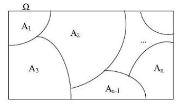

```{r setup, include=FALSE}
knitr::opts_chunk$set(echo = TRUE,
                      comment = NA,
               warning = FALSE,
               message = FALSE)
```

# Conceitos Básicos sobre Probabilidade

Nesta seção vamos explorar os recursos do *R* para resolver problemas de Probabilidade usando conceitos básicos desta teoria até evoluir para as Distribuições de Probabilidade. Sugere-se um prévio conhecimento de Análise estatística descritiva e básico conhecimento de Cálculo.

A leitura do material abaixo pode auxiliar no desenvolvimento do tema.

## Probabilidade


A teoria da probabilidade é a base sobre a qual toda a estatística é desenvolvida, fornecendo um meio para modelar populações, experimentos ou, praticamente,
qualquer outra coisa que possa ser considerada como um fenômeno aleatório. Por meio desses modelos os estatísticos são capazes de fazer inferências sobre populações
através do exame de somente uma parte do todo. Em outras palavras é um conjunto de métodos para quantificar/mensurar a incerteza dos fenômenos.

## Experimento

Um experimento é qualquer processo que permite fazer observações. Um experimento pode ser aleatório ou determinístico.

1- Experimentos aleatórios: são ocorrências que não podem ser previstos com certeza e sim associa-se uma probabilidade

2- Experimentos determinísticos: são ocorrências previstas com certeza

## Espaço Amostral

Espaço amostral, $\Omega$, é o conjunto de todos os resultados possíveis do experimento (Resultado elementar e indivisível).

**obs: Todo resultado do experimento é subconjunto do espaço amostral.**

## Evento

Um evento é uma coleção de possíveis resultados do experimento, normalmente é um subconjunto de $\Omega$. Geralmente os eventos são representados por letras maiúsculas (A, B,...).


## Sigma-Álgebra

Sigma álgebra,$\Lambda$, é uma família de subconjuntos/eventos $\Omega$, se satisfazer as seguintes propriedades:

1- $\emptyset \in \Lambda$

2- Se $A \in \Lambda \Rightarrow A^{c} \in \Lambda$

3- $\Omega \in \Lambda$

4- Se $A_{1}, A_{2},...,\in \Lambda \Rightarrow \displaystyle\cup_{i=1}^{\infty}A_{i} \in \Lambda$

>Agora estamos em condição de definir uma função de probabilidade.

## Definição Clássica de Probabilidade (quando $\Omega$ é finito).

$$
P(A)=\frac{\#A}{\#\Omega}
$$

## Definição Axiomática (Kolmogorov)

Definição axiomática de probabilidade em Sigma-Álgebra é a função $P$ definida em $\Lambda$ e que satisfaz os axiomas seguintes:

A1- $P(A)\ge0$

A2- $P(\Omega)=1$

A3- Se A e B $\in \Lambda$ e são disjuntos $\Rightarrow P(A \cup B) = P(A)+P(B)$

Logo qualquer função $P$ que satisfaça os axiomas acima é chamada função de probabilidade.

## Espaço de Probabilidade

Espaço de Probabilidade é o trio $(\Omega, \Lambda, P)$, que foram definidos acima.


**Exemplo 1:**

Um dado é lançado três vezes e é observado o evento de sair um número ímpar.

A= Sair um número ímpar
$$ A= \{1,3,5\}$$
$$ \Omega=\{1,2,3,4,5,6\}$$
$$P(A)=\frac{\#A}{\#\Omega} =\frac{3}{6}=\frac{1}{2}$$

**Exemplo 2:**

Um dado é lançado três vezes e é observado o evento de sair um número menor que 3.

B= Sair um número menor que 3

$$ B= \{1,2,3\}$$
$$\Omega=\{1,2,3,4,5,6\}$$
$$ P(B)=\frac{\#B}{\#\Omega} =\frac{2}{6}=\frac{1}{3}$$

**Exemplo 3:**

Um dado é lançado e é observado o evento de sair um número maio que 10.

C= Sair um número maior que 10

C= Evento Impossível

**Exemplo 4**

Um dado é lançado e é observado o evento de sair um número inteiro maior ou igual a 1 e menor ou igual a 6.

D= Sair um número menor que 3

D= Evento Certo

>À partir dos axiomas de probabilidade, podemos derivar algumas propriedades da função de probabilidade.


Se $P$ é uma função de probabilidade e $A$ é qualquer conjunto $\in$ $\Lambda$, então:

1- $P(\emptyset)= 0$, onde $\emptyset$ é o conjunto vazio

2- $0 \leq P(A) \leq 1$

3- $P(A^{c})=1-P(A)$

>Se $P$ é uma função de probabilidade e $A$ e $B$ são quaisquer conjuntos $\in$ $\Lambda$, então:

1- $P(B \cap A^{c})=P(B)-P(A \cap B)$

2- $P(A \cup B)= P(A)+P(B)-P(A \cap B)$, se A e B não forem disjuntos

3- Se $A \subset B$, então $P(A)\leq P(B)$


## Probabilidade Condicional e Independência


Em muitos casos, estamos em condição de atualizar as informações de um fenômeno aleatório pois uma determinada etapa pode influenciar nas probabilidades
de ocorrências das etapas sucessivas, ou seja, calcular *probabilidades condicionais*.

## Probabilidade Condicional

Dados dois eventos A e B, a probabilidade condicional de A dado que ocorreu B é representada por $P(A \mid B)$ e dada por:
$$
  P(A \mid B) = \frac{P(A \cap B)}{P(B)}, P(B)>0.
$$

Da definição de probabilidade condicional, deduzimos a \textit{regra do produto de probabilidades}, uma relação bastante útil que é apresentada a seguir:
$$
  P(A \cap B) = P(A \mid B)P(B), P(B)>0.
$$

## Independência de Eventos

Dois eventos A e B são independentes, se a informação da ocorrência ou não de B não altera a probabilidade da ocorrência de A, isto é:
$$
  P(A \mid B)=P(A), P(B)>0,
$$

ou ainda a seguinte forma equivalente:

$$
  P(A \cap B)=P(A)P(B).
$$

## Partição do espaço amostral



Os eventos $A_1, A_2, A_3, ...,A_n$, formam uma partição do espaço amostral, se eles não têm intersecção entre si e se sua união é igual ao espaço amostral, ou seja:

$$
A_i \cap A_j = \emptyset
$$
para $i \neq j$ e 

$$
\bigcup_{i=1}^n A_i = \Omega
$$

## Teorema de Bayes

Suponha que os eventos $A_{1}, A_{2},...,A_{n}$ formem uma partição $\Omega$ e que suas probabilidades sejam conhecidas. Suponha ainda, que para um evento
 B, se conheçam, as probabilidades $P(B \mid A_{i})$ para todo $i = 1,2,...,n$. Então, para qualquer j,

$$
  P(A_{j} \mid B) = \frac{P(B \mid A_{j})P(A_{j})}{\sum_{i=1}^{n}P(B \mid A_{i})P(A_{i})}
 $$


>Vamos ilustrar a aplicação do Teorema de Bayes através do exemplo do doente sadio e o sadio doente(DeGroot e Schervich[02]) que pode ser ecnontrado no livro **Probabilidade e Variáveis Aleatórias**(Magalhães, M. N.) na página 33.

>Uma das formas de avaliar a eficiência de um teste para detectar uma doença é quantificar a probabilidade de erro. Em geral, testes sofisticados envolvem vários procedimentos laboratoriais e diversos equipamentos. Denominamos *falso-positivo* ao erro em que o teste indica positivo para um paciente que não tem a doença. Por outro lado, teremos um erro *falso-negativo* se o teste não acusar a doença num paciente doente. Os erros originam *doentes sadios* e *sadios doentes*. As probabilidades dos erros são calculadas condicionalmente à situação do paciente. Seus complementares fornecem as probabilidades de acerto do teste.

>Para fixar as ideias, considere que um determinado teste resulta positivo para não doentes, com probabilidade $0,1$. Também com probabilidade $0,1$, o teste será negativo para um paciente doente. As informações fornecidas se referem aos erros que podem ser cometidos ao realizar o teste. Se a incidência da doença na população é de 1 para cada 10 mil habitantes, qual é a probabilidade de uma pessoa estar realmente doente se o teste deu positivo? 
Definindo os eventos:

>D: a pessoa está doente

>A: o teste é positivo

>Assim as informações disponíveis são as seguintes:

$$P(D) = 0,0001$$
$$P(A \mid D^c) = 0,1$$
$$P(A^c \mid D) = 0,1$$

>Ainda podemos escrever os complementares:

$$P(D^c) = 0,9999$$
$$P(A \mid D) = 0,9$$

>A probabilidade que desejamos calcular é, $P(D \mid A)$

$$P(D \mid A) = \displaystyle{\frac{P(A \mid D)P(D)}{P(A \mid D)P(D) + P(A \mid D^c)P(D^c)}}$$

$$P(D \mid A) = \displaystyle{\frac{0,9 * 0,0001}{0,9 * 0,0001 + 0,1 * 0,9999}}$$

$$P(D \mid A) = 0,0009$$

>Portanto a probabilidade de estar doente dado que o teste deu positivo é $0,0009$, ou ainda, é aproximadamente 1 em 1000.


# Exercícios no R

>1- Uma escola particular pretende oferecer um treinamento esportista aos seus alunos. Dos 300 alunos entrevistados, 142 optaram pelo voleibol, 123 indicaram o basquete e 35 indicaram o futebol. Selecionando aleatoriamente um desses alunos, qual a probabilidade de obter alguém que prefere o voleibol?

Para calcular no R, basta aplicar a definição clássica de probabilidade. $(1)$.

```{r}
n<-300
volei<-142
pv<-volei/n
round(pv,3)
```

>2- Considerando o experimento de lançamento de um dado e os seguintes eventos:

$A=$ sair número $5$, $B=$ sair par e $C=$ sair ímpar.

Determinar $\Omega$, $P(A)$, $P(B)$, $P(C)$, $P(A \cup B)$, $P(A \cup C)$ e $P(A^{c})$.

Aqui consideramos a propriedade 2 de uma função de probabilidade.

```{r}
omega<-seq(1:6)
omega
PA<-1/length(omega)
PA
PB<-3/length(omega)
PB
PC<-3/length(omega)
PC
PAUB<-PA+PB
PAUB
PAinC<-1/length(omega)
PAinC
PAUC<-PA+PC-PAinC
PAUC
PAc<-1-(PA)
PAc
```

>3- (Bussab $\&$ Moretin, pág. 167, exercício 1):

Dada a função:

$$
f(x)=\begin{cases}
        2e^{-2x}, &\mbox{se}\quad x \geq 0 \\
        0        , &\mbox{se}\quad x< 0
     \end{cases}
$$
       
(a)- Mostre que $f(x)$ é uma função densidade de probabilidade

```{r}
## Para uma função ser f.d.p. não deve ter valores negativos e sua integral deve
## ser igual a 1.
## Definindo f(x) no R.
f1<-function(x){
  fx<-ifelse (x<0,0,2*exp(-2*x))
  return(fx)
}
plot(f1,0,5,ylab='f(x)',xlab=' ',axes=F,col='darkblue')
axis(1, at=seq(0,5,.2), cex.axis=0.5)
axis(2, at=seq(0,2,1), cex.axis=0.75)
box()
abline(v=seq(0,5,1), h=seq(0,2,1), lty=2, col = "gray70")
#abline (v=0, h=0)
## Para verificar se a integral da função é igual a 1, usamos a função integrate
integrate(f1,0,Inf)$value
```

(b)- Calcule a probabilidade de que $X > 1$

Basta calcular a integral da função de densidade dada até infinito:

```{r}
Pb<-integrate(f1,1,Inf)
round(Pb$value,4)
```

(c)- Calcule a probabilidade de que $0,2<X<0,8$

```{r}
Pc<-integrate(f1,0.2,0.8)
round(Pc$value,4)
```

>As probabilidades calculadas nos ítens b e c estão representadas na figura abaixo. A área hachurada indicada como A1 se refere a probalidade do ítem b, $P(X>1)=$ ``r round(Pb$value,4)``. Por sua vez, a área A2 se referere a probabilidade do ítem c, $P(0.2<X<0.8)=$ ``r  round(Pc$value,4)``

```{r}
plot(f1,0,5,ylab='f(x)',xlab=' ',axes=F,col='darkblue')
axis(1, at=seq(0,5,.2), cex.axis=0.5)
axis(2, at=seq(0,2,1), cex.axis=0.75)
box()
abline(v=seq(0,5,1), h=seq(0,2,1), lty=2, col = "gray70")
polygon(x=c(1,seq(1,5,l=20)), y=c(0,f1(seq(1,5,l=20))),density=75)
polygon(x=c(0.2,seq(0.2,0.8,l=20),0.8), y=c(0,f1(seq(0.2,0.8,l=20)),0),density=75)
x=c(0.2,seq(0.2,0.8,l=20),0.8)
y=c(0,f1(seq(0.2,0.8,l=20)),0)
text(c(1.3,0.5),c(0.08,0.08), c(expression(A1,A2)),col=c('red','red'))
```


>4- (Bussab $\&$ Moretin, pág. 173, exercício 10)

A demanda diária de arroz em um supermercado, em centenas que quilos, é uma variável aleatória $X$ com a seguinte f.d.p.:

$$
f(x)=\begin{cases}
        \frac{2x}{3}    , &\mbox{se}\quad 0 \leq x < 1 \\
        \frac{-x}{3}+1 , &\mbox{se}\quad 1 \leq x < 3 \\
        0              , &\mbox{se}\quad x < 0 \quad ou \quad x \geq 3
     \end{cases}
$$

(a.) Qual a probabilidade de se vender mais do que 150Kg, num dia escolhido ao acaso?

Primeiro a função de densidade no R

```{r}
## Definindo f(x) no R
f2<-function(x){
  fx<-numeric(length(x))
  fx[x<0]<-0
  fx[x>=0 & x<1]<-2*x[x>=0 & x<1]/3
  fx[x>=1 & x<3]<-(-x[x>=1 & x<3]/3)+1
  fx[x>3]<-0
  return(fx)
}
```

Agora calculamos a probabilidade de $X>1,5$, pois a função mede a venda de arroz em centenas de quilos.

```{r}
## Calculando a probabilidade de x>1,5, pois a função mede a venda de arroz
## em centenas de quilos.
Pa<-integrate(f2,1.5,Inf)
round(Pa$value,4)
```

(b)- Em 30 dias, quanto o gerente do supermercado espera vender?

Vamos primeiro criar uma função no R que calcula a média de uma variável aleatória contínua:

```{r}
## Primeiro definimos a função para calcular média 
## de uma variável aleatória contínua
ef2<-function(x){
    x*f2(x)
}
```

Em seguida calculamos a média diária de venda:

```{r}
## Em seguida calculamos a média diária de venda
mean.day<-integrate(ef2,0,3)
round(mean.day$value,4)
```

E por fim multiplicamos por 30 temos o valor esperado de venda mensal:

```{r}
30*mean.day$value
```

(c)- Qual a quantidade de arroz em $95\%$ dos dias?

Para este cálculo precisamos calcular o quantil de $95\%$ da distribuição de probabilidade:

```{r}
f <- function(x) abs(0.95 - integrate(f2, 0, x)$value)
optimise(f, c(0, 3))
```


# Definição de variável aleatória

Uma variável aletória $X$ em um espaço de probabilidade $\Omega, \Lambda, P$ é uma função real definida no espaço $\Omega$, tal que o evento $[X \leq x]$ é um evento aleatório, $\forall x \in \mathbb{R}$, isto é, $X: \Omega \longrightarrow \mathbb{R}$ é variável aleatória se o evento $[X \leq x] \in \Lambda, \forall x \in \mathbb{R}$.
A função $X(\omega)$ é variável aleatória se associa a cada evento no espaço amostral $\Omega$ um número real.

# Definição de Variável aleatória discreta

Seu campo de variação é um conjunto finito ou infinito enumerável.

# Definição de Variável aleatória contínua

Seu campo de variação é um conjunto infinito(indeterminado) não-enumerável.

>Uma vez que uma variável aleatória assume um valor do seu campo de variação com uma certa probabilidade, tem-se que as probabilidades são associadas à valores de uma variável aleatória discreta por uma função de probabilidade e as probabilidades são associadas a intervalos de valores de uma variável aleatória contínua por uma função densidade de probabilidade.

# Definição de função de probabilidade (f.p.)

A f.p. de uma variável aleatória discreta, representada por $P(X=x) = p(x)$ é qualquer função tal que $X(\omega) \in \{x_1, x_2, ...\} \forall \omega \in \Omega$, tem-se $p(x_i) \geq 0$ e $\displaystyle{\sum_{i=1}^\infty}p(x_i)=1$

# Definição de função densidade de probabilidade (f.d.p.)

A f.d.p. de uma variável aleatória contínua, representada por $f_x(x)$ é qualquer função tal que $f_x(x) \geq 0$ e $\displaystyle{\int_{-\infty}^{\infty}} f_x(x) = 1$


# Esperança matemática

A esperança matemática de uma variável aleatória é usualmente referida como uma medida de posição da distribuição dessa variável. Valor esperado, pondera os valores assumidos da variável aleatória pelas
respectivas probabilidades. É calculada para variáveis aleatórias discretas e contínuas.

>Seja $X$ uma variável aleatória discreta, a esperança matemática é:

$$
\mu = E(x) = \displaystyle{\sum_{i=1}^n} x_i P_x(x) = \displaystyle{\sum_{i=1}^n} x_i P(X=x_i)
$$

>Seja $X$ uma variável aleatória contínua, a esperança matemática é:

$$
\mu = E(x) = \displaystyle{\int_{-\infty}^{\infty}} xf_x(x)dx
$$

## Propriedades da esperança matemática

Considere K uma constante:

- $E(K) = K$
- $E(KX) = KE(X)$
- $E(X \pm K) = E(X) \pm K$
- $E(X \pm \ Y) = E(X) \pm E(Y)$
- Se $X$ e $Y$ independentes, $E(XY)=E(X)E(Y)$

# Variância

>Seja $X$ uma variável aleatória discreta, a sua variância é:

$$
\sigma^2 = Var(X) = E[X-\mu]^2 = E(X^2) - [E(X)]^2
$$

onde, $E(X^2) = \displaystyle{\sum_{i=1}^n}x_i^2P(X=x_i)$

>Seja X uma variável aleatória contínua, a sua variância é:

$$
\sigma^2 = Var(X) = E[X-\mu]^2 = E(X^2) - [E(X)]^2
$$

onde, $E(X^2) = \displaystyle{\int_{-\infty}^\infty}x_i^2f_x(X)dx$


## Propriedades da variância

Considere K uma constante:

- $Var(K)=0$
- $Var(KX)=K^2Var(X)$
- $Var(K \pm X) = Var(X)$
- $V(X \pm Y) =  Var(x) + Var(Y) \pm 2 cov(X,Y)$, em que $cov(X,Y) = E(XY)-E(X)E(Y)$

# Distribuições de Probabilidade Discreta

O conhecimento de modelos probabilísticos para variáveis quantitativas é muito importante e esta aula será dedicada a resolução de problemas para variáveis aleaórias discretas. Através do R iremos construir esses modelos e fazer inferências sobre seus parâmetros.

Vamos explorar os principais modelos de probabilidade para variável aleatória discreta:

1- Uniforme Discreta

2- Bernoulli

3- Binomial

4- Poison

5- Geométrica

6- Hipergeométrica

Para resolução dos exercícios vamos explorar as seguintes funcionalidades do R para operações 
com distribuição de probabilidade:

*d:* calcula a densidade de probabilidade ***$f(x)$*** no ponto

*p:* calcula a função de probabilidade acumulada ***$F(x)$*** no ponto

*q:* calcula o quantil correspondente a uma dada probabilidade

*r:* gera uma amostra aleatória da distribuição


Para usar essas funcionalidades basta combinar essas letras com o nome da função no R referente a
distribuição desejada. Por exemplo, calcular o quantil de $95\%$ da distribuição Normal usamos *q* de quantil e norm de Normal.

```{r}
qnorm(0.95)
```

## Distribuição Uniforme Discreta

O modelo uniforme discreto representa situações em que todos os possíveis valores da variável são equiprováveis.

$X \sim U_{d}(E)$, $E$ é o conjunto de seus valores

$p(x)=\displaystyle\frac{1}{k}$

$E(x)=\displaystyle\frac{1+k}{2}$
  
$Var(x)=\displaystyle\frac{k^{2}-1}{12}$

Provavelmente por se tratar de uma distribuição tão simples não há uma função no $R$ para a Uniforme Discreta. Como a teoria diz que em todos os valores da variável que segue uma distribuição Uniforme Discreta têm mesma probabilidade, podemos usar a função ``sample()`` para representar esta distribuição.

### Exercício 4

Uma variável aleatória $X \sim U_{d}(1:10)$, e queremos selecionar 15 valores.

>Como temos uma amostra de tamanho $10$ e queremos selecionar $15$ valores, teremos que fazer uma seleção com reposição e para isso usaremos a função ``sample()`` com o argumento ``replace=TRUE``.

```{r}
set.seed(1999123)
sample(1:10,15, replace=TRUE)
```


### Exercício 5

Exemplo de lançamento de um dado.

```{r}
d<-1:6
fx<-rep(1/6,6)
fx
Fx<-d/6
Fx
par(mfrow=c(1,2))
## Gráfico da função de probabilidade
plot(d, fx, type = "h", axes=F, xlab='Valores de x',
     ylab=substitute(paste(italic('p(x)'))),cex.lab=.7,col='darkblue')
title('Gráfico Função de Probabilidade',cex.main=.7)
axis(1, at=seq(0,6,1), cex.axis=0.65)
axis(2, at=seq(0,1,.1),cex.axis=0.65)
box()

## Gráfico da função de distribuição
plot(d, Fx, type = "s",axes=F, lwd=2, xlab='Valores de x',
     ylab=substitute(paste(italic('F(x)'))),cex.lab=.7,col='darkblue')
title('Gráfico Função de Distribuição',cex.main=.7)
axis(1, at=seq(0,6,1), cex.axis=0.65)
axis(2, at=seq(0,1,.1),cex.axis=0.65)
box()
```

## Distribuição de Bernoulli

Uma variável aleatória que assume apenas valores $0$ e $1$ com função de probabilidade representada por:

$$X \sim Ber(p)$$

$$
    p(x)=p^{x}(1-p)^{1-x}
$$  
  
$$E(x)=p$$
  
$$Var(x)=p(1-p)$$

### Exercício 1

Calcule a função de probabiliade e função de distribuição da variável $X \sim Ber(0.6)$:

>Pimeiro mostramos graficamente como ficaria a função de probabilidade:

$$p(0)=P(X=0)=1-p=1-0.6=0.4$$

$$p(1)=P(X=1)=p=0.6$$

```{r}
x<-c(0,1)
Px<-c(0.4,0.6)
plot(x,Px,type='h',axes=F,lwd=1,asp=2,xlab='Valores de x',
     ylab=substitute(paste(italic('P(x)'))),cex.lab=.7)
axis(1, at=seq(0,1,1), cex.axis=0.65)
axis(2, at=seq(0,1,.1), cex.axis=0.65)
box()
title('Gráfico Função de Probabilidade',cex.main=.7)
```

>E agora o gráfico da função distribuição, *$F(x)=P(X \leq x)$*.

```{r}
x<-c(0,0,0.5,0.5,1)
Fx<-c(0,0.4,0.4,1,1)
plot(x,Fx,type='s',axes=F,lwd=2,xlab='Valores de x',
     ylab=substitute(paste(italic('F(x)'))),cex.lab=.7)
axis(1, at=seq(0,1,1), cex.axis=0.65)
axis(2, at=seq(0,1,.1),cex.axis=0.65)
title('Gráfico Função de Distribuição',cex.main=.7)
box()
```

## Distribuição Binomial

Uma variável aleatória segue uma distribuição Binomial quando repetimos um ensaio Bernoulli $n$ vezes, ou seja, quando temos uma amostra de tamanho $n$ de uma distribuição Bernoulli. Um exemplo é um ensaio com caracterśtica dicotômica como a morte ou não de um paciente ou sucesso ou fracasso de um evento.

$$X \sim Bin(n,p)$$

$$
p(x)=\binom{n}{x}  p^{x}(1-p)^{n-x}
$$


$$E(x)=np$$
  
$$Var(x)=np(1-p)$$

$$
M_x(t) = (pe^t+1-p)^n
$$

### Exercício 2

Seja uma variável aleatória com distribuição Binomial, uma amostra de tamanho $10$ e probabilidade de sucesso de $0,35$. Represente esta variável no R.

>Inicialmente vamos gerar os valores que a variável X pode receber.

```{r}
x <- 0:10
```

>Próximo passo é gerar as probabiliades para cada valor de x.
 
```{r}
fx <- dbinom(x, 10, 0.35)
```


>Agora calculando a função de distribuição

```{r}
Fx <- pbinom(x, 10, 0.35)
```


>A função de probabilidade pode ser representada da seguinte forma:

```{r}
plot(x, fx, type = "h", axes=F, xlab='Valores de x',
     ylab=substitute(paste(italic('p(x)'))),cex.lab=.7,col='darkblue')
title('Gráfico Função de Probabilidade',cex.main=.7)
axis(1, at=seq(0,10,1), cex.axis=0.65)
axis(2, at=seq(0,1,.05),cex.axis=0.65)
box()
```

>E a representação gráfica da função de distribuição

```{r}
plot(x, Fx, type = "s",axes=F, lwd=2, xlab='Valores de x',
     ylab=substitute(paste(italic('F(x)'))),cex.lab=.7,col='darkblue')
title('Gráfico Função de Distribuição',cex.main=.7)
axis(1, at=seq(0,10,1), cex.axis=0.5)
axis(2, at=seq(0,1,.05),cex.axis=0.45)
box()
```

>Agora vamos calcular as seguintes probabilidades:

(a)- $P[X=7]$

```{r}
dbinom(7,10,0.35)
# Outra forma
fx[8]
```

(b)- $P[X < 8]$

>É a mesma coisa que calcular $P[X<=7]$, ou seja, a probabilidade acumulada até $X=7$.

```{r}
pbinom(7,10,0.35)
Fx[8]
```

(c)- $P[X \geq 8]$

>É o mesmo que calcular $P[X>7]$.

```{r}
1-pbinom(7,10,0.35)
pbinom(7,10,0.35,lower = F)
1-Fx[8]
```

d)] $P[3 < X \leq 6]$

>É o mesmo que calcular $P[4 \leq X \leq 6]$

```{r}
sum(dbinom(4:6, 10, 0.35)) 
sum(fx[5:7])
pbinom(6, 10, 0.35) - pbinom(3, 10, 0.35) 
Fx[7]-Fx[4]
```


## Distribuição Poisson

O modelo Poisson tem sido muito utilizado em experimentos das áreas da saúde, física e biológica em que $\lambda$ mede a taxa de oorrência por unidade de medida, ou seja, o parâmetro $\lambda$ é frequência média ou esperada de ocorrências num determinado intervalo de tempo.

$$X \sim Pois(\lambda)$$

$$p(x)=\displaystyle\frac{e^{-\lambda}\lambda^{x}}{x!}$$
  
$$E(x)=\lambda$$
  
$$Var(x)=\lambda$$

$$
M_x(t) = e^{\lambda[e^t-1]}
$$
### Exercício 3

A emissão de partículas radioativas tem sido modelada através de uma distribuição Poisson. Suponha que o número de partículas, emitidas por minuto, em uma determinada região tem parâmetro $5$, ou seja, $5$ partículas radioativas são emitidas a cada minuto. Calcule a probabilidade de haver mais de $2$ emissões por minuto.


>Primeiro os gráficos da função de probabilidade e função distribuição acumulada.

```{r}
x<-1:15
fx<-dpois(x,5)
Fx<-ppois(x,5)

par(mfrow=c(1,2))
## Gráfico da função de probabilidade
plot(x, fx, type = "h", axes=F, xlab='Valores de x',
     ylab=substitute(paste(italic('p(x)'))),cex.lab=.7,col='darkblue')
title('Gráfico Função de Probabilidade',cex.main=.7)
axis(1, at=seq(0,15,1), cex.axis=0.45)
axis(2, at=seq(0,1,.05),cex.axis=0.45)
box()


## Gráfico da função de distribuição
plot(x, Fx, type = "s",axes=F, lwd=2, xlab='Valores de x',
     ylab=substitute(paste(italic('F(x)'))),cex.lab=.7,col='darkblue')
title('Gráfico Função de Distribuição',cex.main=.7)
axis(1, at=seq(0,15,1), cex.axis=0.45)
axis(2, at=seq(0,1,.05),cex.axis=0.45)
box()
```

>Agora vamos calcular a probabilidade acumulada até X=2, 1 menos esse valor é a probabilidade que procuramos, ou seja, $1-P(X=2) = P(X>2)$.

```{r}
1-ppois(2,5)
```

## Distribuição Geométrica

Novamente vamos considerar n ensaios Bernoulli independentes. Uma variável aleatória $X$ seguirá uma distribuição Geométrica quando $X$ for o número de fracassos anteriores ao primeiro sucesso.

$$
X \sim Geo(p)
$$

$$
p(x) = p(1-p)^x
$$

$$
E(x) = \displaystyle{\frac{1-p}{p}}
$$

$$
Var(x) = \displaystyle{\frac{1-p}{p^2}}
$$

$$
M_x(t) = \displaystyle{\frac{p}{1-(1-p)e^t}}
$$

## Distribuição Hipergeométrica

Considere um conjunto com $n$ objetos dos quais $m$ são do tipo $I$ e $n-m$ são do tipo $II$. Uma amostra é escolhida ao acaso so reposição, com tamanho $r(r<n)$ e definimos $X$ como o número de objetos com a característica $I$ na amostra.

$$
P(X=k) = \displaystyle{\frac{\left( \begin{array}{c}m \\ k \end{array}\right) \left( \begin{array}{cc}n-m \\ r-k \end{array}\right)}{\left( \begin{array}{c}n \\ r \end{array}\right)}}
$$

$$
X \sim Hgeo(m,nr)
$$

$$
E(x) = r \displaystyle{\frac{m}{n}}
$$

$$
Var(x) = r \displaystyle{\frac{m}{n}\frac{(n-m)}{n} (1-\frac{r-1}{n-1})}
$$

A função geradora de momentos da hipergeométrica existe, mas ela é escrita dependendo de uma função introduzida por Gauss conhecida como função hipergeométrica. Ela pode ser vista no link abaixo:

<http://www.portalaction.com.br/probabilidades/54-distribuicao-hipergeometrica>


# Distribuições de Probabilidade Contínua

Esta aula será dedicada a resolução de problemas
para variáveis aleaórias contínuas. Através do $R$ iremos construir esses modelos e fazer inferências sobre seus parâmetros.

Vamos explorar os principais modelos de probabilidade para variável aleatória contínua:

1- Normal

2- Uniforme Contínua

3- Exponencial


## Distribuição Normal

A distribuição Normal é definda pelos parâmetros média e variância com a função abaixo:

$$X \sim N(\mu, \sigma^{2})$$

$$f(x) = \frac{1}{\sqrt{2\pi\sigma^2}} \exp\{\frac{-1}{2\sigma^2}(x - \mu)^2\}$$


$$E(x)=\mu$$

$$Var(x)=\sigma^2$$

$$
M_x(t)=e^{\mu t + \sigma^2t^2}
$$

Quando $\mu=0$ e $\sigma^2=1$, dizemos de $X$ segue uma distribuição Normal Padrão.

O *default* do $R$, para as funções da Normal, assume a distribuição Normal Padrão, $X\sim N(0,1)$

### Exercício

1- Seja $X \sim N(0,1)$, calcule a densidade da função quando $X=3$.

```{r}
dnorm(3)
```

>Também podemos simplesmente substituir os valores dos parâmetros, N(0,1), no ponto 3 na função de densidade, ou seja:

$$
 f(x=3) = \frac{1}{\sqrt{2\pi}} \exp\{\frac{-3^2}{2}\}
$$

```{r}
(1/sqrt(2 * pi)) * exp((-1/2) * (3)^2)
```


2- Calcule a probabilidade de $P[X \leq 3]$

```{r}
pnorm(3)
```

>Isso seria o equivalente a resolver a seguinte integral:

$$\int_{-\infty}^{3} f(x) dx$$

$$\int_{-\infty}^{3} \frac{1}{\sqrt{2\pi\sigma^2}} \exp\{\frac{-1}{2\sigma^2}(x - \mu)^2\} dx$$

$$\int_{-\infty}^{3} \frac{1}{\sqrt{2\pi}} \exp\{\frac{-x^2}{2}\}dx$$


>Escrevendo a integral acima no R:

```{r}
fx<-function(x){
  f<-(1/sqrt(2*pi))*exp(-x^2/2)
  return(f)
}

integrate(fx, -Inf, 3)$value
```


3- Encontre o quantil da Normal que equivale a ``r 100*round(pnorm(3),4)``$\%$ da sua área.

>Agora faremos o caminho inverso do exercício anterior:

```{r}
qnorm(0.9987)
## ou ainda
qnorm(0.9986501)
```

```{r}
qnorm(0.975)
```

5- Gere 5 valores aleatórios de uma Normal padrão.

```{r}
rnorm(5)
```

>Abaixo representação gráfica de algumas probabilidades de $X \sim N(0,1)$.

```{r}
par(mar=c(4,4,1,1))
for(q in seq(0, 3,l=5)){
  curve(dnorm(x, 0, 1), -5, 5, ylab=substitute(paste(italic('f(x)'))), xlab="z")
  x <- seq(0, q, by=0.01)
  fx <- dnorm(x)
  polygon(c(x, rev(x)),
          c(fx, rep(0, length(fx))),
          col="tomato")
  abline(v=0, lty=2)
  Pr <- round(pnorm(q, 0, 1)-0.5, digits=3)
  qq <- round(q, digits=3)
  legend("topleft", bty="n", fill="grey",
         legend=substitute(P(0<~Z<~q)==Pr, list(q=qq, Pr=Pr)))
}
```

>As funções relaciondas a distribuição Normal possuem os argumentos mean e sd para definir média e desvio padrão da distribuição que podem ser modificados como nos exemplos a seguir.

>Note nestes exemplos que os argumentos podem ser passados de diferentes formas.

```{r}
qnorm(0.975, mean = 100, sd = 8)
qnorm(0.975, m = 100, s = 8)
qnorm(0.975, 100, 8)
```

### Exercício

Cálculos de probabilidades usuais, para os quais utilizávamos tabelas estatísticas podem ser
facilmente obtidos como no exemplo a seguir.

Seja X uma variável aleatória $X \sim N(100, 100)$. Calcular as probabilidades:

(a)- $P(X < 95)$

(b)- $P(90 < X < 110)$

(c)- $P(X > 95)$

>Resolvendo o ítem (a):

```{r}
## a)
pnorm(95,100,10)
```

>Resolvendo o ítem (b):

```{r}
## b)
pnorm(110, 100, 10) - pnorm(90, 100, 10)
```

>Resolvendo o ítem (c):

```{r}
## c)
1-pnorm(95, 100, 10)
pnorm(95, 100, 10, lower=F)
```

>Agora vamos plotar os gráficos da função densidade de probabilidade, $f(x)$ e da função de distribuição, $F(x)$.

```{r}
par(mfrow=c(1,2))
## Gráfico da função densidade de probabilidade
x <- seq(70, 130, len = 100)
fx <-dnorm(x,100,10) 
plot(x,fx,  axes=F, type='l',xlab='Valores de x',
     ylab=substitute(paste(italic('f(x)'))),cex.lab=.7,col='tomato')
title('Gráfico Função de Densidade de Probabilidade',cex.main=.7)
axis(1, at=seq(70,130,10), cex.axis=0.45)
axis(2, at=seq(0,1,.01),cex.axis=0.45)
box()

## Gráfico da função de distribuição
Fx<-pnorm(x,100,10)
plot(x, Fx, type = "l",axes=F, lwd=2, xlab='Valores de x',
     ylab=substitute(paste(italic('F(x)'))),cex.lab=.7,col='tomato')
title('Gráfico Função de Distribuição',cex.main=.7)
axis(1, at=seq(70,130,10), cex.axis=0.45)
axis(2, at=seq(0,1,.1),cex.axis=0.45)
box()
```

### Exercício

Agora vamos explorar diferentes densidades da Normal. Basta variar a seus parâmetros. Principalmente a variância.

```{r}
myTitle1 <- bquote (paste("X ~ Normal(", mu, ',', sigma,")") )

plot(function(x) dnorm(x, 100, 8), 60, 140, ylab = substitute(paste(italic('f(x)'))),
     xlab='Valores de x',main=myTitle1)
plot(function(x) dnorm(x, 90, 8), 60, 140, add = T, col = 2)
plot(function(x) dnorm(x, 100, 15), 60, 140, add = T, col = 3)
legend(110, 0.05, c("N(100,64)", "N(90,64)", "N(100,225)"), fill = 1:3)
```


## Distribuição Uniforme Contínua

Para a distribuição uniforme contínua usa-se as funções ``unif()``. 

$$X \sim U(a,b)$$

$$f(x)=\displaystyle\frac{1}{b-a}I_{(a,b)}(x)$$

$$E(x)=\displaystyle\frac{a+b}{2}$$

$$Var(x)=\displaystyle\frac{(b-a)^2}{12}$$

$$
M_x(t) = \displaystyle{\frac{e^{tb}-e^{ta}}{t(b-a)}}
$$

### Exercício

>Nos comandos a seguir inspecionamos os argumentos, sorteamos 5 valores da $U(0, 1)$ e calculamos a probabilidade acumulada até 0,75.

```{r}
args(runif)
runif(5,0,1)
punif(0.75,0,1)
```

>E a representação gráfica

```{r}
par(mfrow=c(1,2))
## Gráfico da função densidade de probabilidade
x <- seq(0, 1, len = 100)
fx <-dunif(x,0,1)
plot(x,fx,  axes=F, type='l',xlab='Valores de x',
     ylab=substitute(paste(italic('f(x)'))),cex.lab=.7,col='tomato')
title('Gráfico Função de Densidade de Probabilidade',cex.main=.7)
axis(1, at=seq(0,1,.1), cex.axis=0.45)
axis(2, at=seq(0,2,.1),cex.axis=0.45)
box()

## Gráfico da função de distribuição
Fx<-punif(x,0,1)
plot(x, Fx, type = "l",axes=F, lwd=2, xlab='Valores de x',
     ylab=substitute(paste(italic('F(x)'))),cex.lab=.7,col='tomato')
title('Gráfico Função de Distribuição',cex.main=.7)
axis(1, at=seq(0,1,.1), cex.axis=0.45)
axis(2, at=seq(0,1,.1),cex.axis=0.45)
box()
```

## Distribuição Exponencial

A função de densidade de probabilidade da distribuição exponencial com parâmetro $\lambda$ e denotada $\exp(\lambda)$:

$$X \sim \exp(\lambda)$$

$$f(x)=\lambda e^{-\lambda x}I_{(0,\infty)}(x)$$

$$E(x)=\displaystyle\frac{1}{\lambda}$$

$$Var(x)=\displaystyle\frac{1}{\lambda^2}$$

$$M_x(t) = \displaystyle{\frac{\lambda}{\lambda-t}}$$

### Exercício

Seja uma variável aleatória $X \sim \exp(\lambda=500)$. Calcular a probabilidade $P(X \geq 400)$.

```{r}
1-pexp(400,1/500)
pexp(400,1/500,lower=F)
fexp <- function(x, lambda = 500) {
 fx <- ifelse(x < 0, 0, (1/lambda) * exp(-x/lambda))
 return(fx)
 }
integrate(fexp, 400, Inf)$value
```


>Agora plotando os gráficos de densidade e distribuição.

```{r}
x <- seq(0, 2000, l = 200)
fx <- dexp(x, rate = 1/500)

par(mfrow=c(1,2))
plot(x, fx, type = "l",axes=F,col='tomato',xlab='Valores de x',
     ylab=substitute(paste(italic('f(x)'))),cex.lab=.7)
ax <- c(400, 400, x[x > 400], 2000, 2000)
ay <- c(0, dexp(c(400, x[x > 400], 2000), 1/500), 0)
polygon(ax, ay,col='tomato',density=50)
title('Gráfico Função Densidade de Probabilidade',cex.main=.7)
axis(1, at=seq(0,2000,100), cex.axis=0.5)
axis(2, at=seq(0,1,.0005),cex.axis=0.5)
box()


Fx <- pexp(x, rate = 1/500)
plot(x, Fx, type = "l",axes=F,col='tomato',xlab='Valores de x',
     ylab=substitute(paste(italic('f(x)'))),cex.lab=.7)
title('Gráfico Função de Distribuição',cex.main=.7)
axis(1, at=seq(0,2000,100), cex.axis=0.5)
axis(2, at=seq(0,1,.05),cex.axis=0.5)
box()
```

## Distribuição Qui-quadrado - $\chi^2$

$$X \sim \chi_{(\nu)}$$

$$f(x)=\displaystyle\frac{1}{\Gamma(\nu \mid 2) 2^{\nu \mid 2}} x^{(\nu \mid 2)-1} e^{-x \mid 2}$$

$$E(x) = \nu$$

$$Var(x) = 2\nu$$

$$M_x(t) = \displaystyle{(\frac{1}{1-2t})^{\nu/2}}$$

>Explorando a Distribuição Qui-quadrado


```{r}
help(dchisq)
x<-1:40
 plot(x,x*0,pch="",ylim=range(c(0,0.15)),xlim=range(c(0,40)),
         xlab="x",ylab="f(x)",bty="n")
 lines(dchisq(x,1),lty=1,pch=1)
 lines(dchisq(x,5),lty=2,pch=2)
 lines(dchisq(x,12),lty=3,pch=3)
 lines(dchisq(x,25),lty=4,pch=4)
 lines(dchisq(x,30),lty=5,pch=5)
 pchisq(3.84,1)
 1-pchisq(3.84,1)
 qchisq(0.95,1)
 gera<-sort(rchisq(5000,5))
 plot(dchisq(gera,5),type='l', lwd=.7)
```


>Uma consideração importante a fazer sobre a distribuição Qui-quadrado é sua relação com a distribuição  normal padrão. Uma variável aleatória que segue uma distribuição qui-quadrado nada mais é do que uma variável aleatória com distribuição normal padrão elevada ao quadrado.

>Vamos definir uma variável aleatória que segue uma distribuição normal padrão e gerar 100 valores para esta variável:

```{r}
set.seed(19991233)
x<- seq(-3,3,.1)
```

>Elevamos a variável aleatória $x$ ao quadrado:

```{r}
x2<-x^2
```

>Agora vamos representar ambas graficamente

```{r}
par(mfrow=c(1,2))
#myTitle1 <- bquote (paste("X ~ Normal(", 0, ',', 1,")") )
myTitle2 <- bquote (paste("X ~", chi^2))
x22<-sort(x2)
plot(x22, dnorm(x22),col='blue', type='l',xlab='', ylab='',
     main='Normal Padrão \n elevado ao quadrado')
plot(seq(0,9,.1),dchisq(seq(0,9,.1),1),type='l', col='darkgreen',
     xlab='', main=myTitle2,ylab='')
text(6,1,'g.l.=1')
```

>Outra relação que a qui-quadrado possui é com a distribuição exponencial. Uma variável aletória que segue uma distribuição exponencial com $\lambda=2$, também é um caso particuar de uma qui-quadrado com $\nu=2$.

```{r}
rm(list=ls())
set.seed(19991233)
x<- seq(0,5,.1)

par(mfrow=c(1,2))
myTitle1 <- bquote (paste("X ~ Exp(", 2,")") )
myTitle2 <- bquote (paste("X ~", chi^2))

plot(x, dexp(x,1/2),col='blue', type='l',xlab='', ylab='',
     main=myTitle1)
plot(x,dchisq(x,2),type='l', col='darkgreen',
     xlab='', main=myTitle2,ylab='')
text(4,.4,'g.l.=2')

```

### Exercícios Propostos

>Explore as distribuições de probabilidade contínua abaixo, com os comandos e idéias apresentados nesta aula.

1- Gamma

2- Weibull

3- Beta

4- t-student

5- F-Snedcor

# Teorema central do limite

Nesta aula será apresentado o **Teorema central do limite** que trata do estudo da convergência da soma de $n$ variáveis aleatórias para um modelo gaussiano. O Teorema central do limite possui várias versões e a demonstração de seus resultados serão omitidos aqui, mas alguns de seus teoremas e suas respectivas demonstrações podem ser encontradas no livro **Probabilidade e variáveis aletórias**, Marcos Nascimento Magalhães.

Agora será apresentado um resultado muito importante decorrente deste teorema. Considere qualquer que seja a distribuição da variável de interesse para uma grande amostra e se calcularmos a média para $n$ amostras de mesmo tamanho, a distribuição dessas médias amostrais seguirá aproximadamente uma distribuição gaussiana, e tenderá a uma distribuição gaussiana à medida que o tamanho de amostra crescer. Então podemos ter uma variável original com uma distribuição discreta como a Binomial ou Poisson, por exemplo, e então se fizermos um gráfico da densidade das médias amostrais irá se aproximar empiricamente da distribuição teórica gaussiana.

>Abaixo um exemplo no $R$

Primeiro calculando médias de 10 amostras cada uma com 15 observações de uma certa população que pode seguir qualquer distribuição. A segunda distribuição teremos 30 amostras, depois 200 amostras e por fim 5000.
Portanto as amostras com as médias amostrais terão tamanhos 10, 30, 200 e 5000 respectivamente.


```{R}
#====== N 10 ========
set.seed(1999)
y <- rnorm(1000)
ystar <- NULL
nBoot <- 10
#número de amostras bootstrap 
B <- array(0,dim=c(nBoot, 1)) # array p/ guardar o bootstrap
for(i in 1:nBoot){
#laço p/ bootstrap
    ystar <- sample(y,size=15,replace=F)
    B[i] <- mean(ystar)
    }

par(mfrow=c(2,2))
hist(B,breaks='Sturges',prob=T,col='grey90',border='white',axes=F,
     ylab='',cex.axis=0.65,main='',xlab='Dist. amostral das médias',
     cex.lab=0.8,cex.main=0.8,ylim=c(0,1.8),font=2)
axis(1, at=seq(-0.8,0.8,0.1), cex.axis=0.7)
lines(density(B),col='darkblue')
lines(sort(B),dnorm(sort(B), mean(B),sd(B)),col='darkorange')
legend(0,1.5, legend = c("Empírica", "Teórica"),
       bty='n',fill=c("darkblue", "darkorange"),
       xjust = 1, yjust = 1,
       text.col=c('darkblue','darkorange'),
       col=c('darkblue','darkorange'))
title(main=substitute(paste(italic('Amostra de tamanho'),bold(' 10'))),cex.main=1)

#====== N 30 ========
ystar <- NULL
nBoot <- 30
#número de amostras bootstrap 
B <- array(0,dim=c(nBoot, 1)) # array p/ guardar o bootstrap
for(i in 1:nBoot){
#laço p/ bootstrap
    ystar <- sample(y,size=15,replace=F)
    B[i] <- mean(ystar)
    }

hist(B,breaks='Sturges',prob=T,col='grey90',border='white',axes=F,
     ylab='',cex.axis=0.65,main='',xlab='Dist. amostral das médias',
     cex.lab=0.8,cex.main=0.8,ylim=c(0,1.7),font=2)
axis(1, at=seq(-0.8,0.8,0.1), cex.axis=0.7)
lines(density(B),col='darkblue')
lines(sort(B),dnorm(sort(B), mean(B),sd(B)),col='darkorange')
legend(0,1.5, legend = c("Empírica", "Teórica"),
       bty='n',fill=c("darkblue", "darkorange"),
       xjust = 1, yjust = 1,
       text.col=c('darkblue','darkorange'),
       col=c('darkblue','darkorange'))
title(main=substitute(paste(italic('Amostra de tamanho'),bold(' 30'))),cex.main=1)


#====== N 200 ========
ystar <- NULL
nBoot <- 200
#número de amostras bootstrap 
B <- array(0,dim=c(nBoot, 1)) # array p/ guardar o bootstrap
for(i in 1:nBoot){
#laço p/ bootstrap
    ystar <- sample(y,size=15,replace=F)
    B[i] <- mean(ystar)
    }

hist(B,breaks='Sturges',prob=T,col='grey90',border='white',axes=F,
     ylab='',cex.axis=0.65,main='',xlab='Dist. amostral das médias',
     cex.lab=0.8,cex.main=0.8,ylim=c(0,1.7),font=2)
axis(1, at=seq(-0.8,0.8,0.1), cex.axis=0.7)
lines(density(B),col='darkblue')
lines(sort(B),dnorm(sort(B), mean(B),sd(B)),col='darkorange')
legend(0,1.5, legend = c("Empírica", "Teórica"),
       bty='n',fill=c("darkblue", "darkorange"),
       xjust = 1, yjust = 1,
       text.col=c('darkblue','darkorange'),
       col=c('darkblue','darkorange'))
title(main=substitute(paste(italic('Amostra de tamanho'),bold(' 200'))),cex.main=1)

#====== N 5000 ========
ystar <- NULL
nBoot <- 5000
#número de amostras bootstrap 
B <- array(0,dim=c(nBoot, 1)) # array p/ guardar o bootstrap
for(i in 1:nBoot){
#laço p/ bootstrap
    ystar <- sample(y,size=15,replace=F)
    B[i] <- mean(ystar)
    }

hist(B,breaks='Sturges',prob=T,col='grey90',border='white',axes=F,
     ylab='',cex.axis=0.65,main='',xlab='Dist. amostral das médias',
     cex.lab=0.8,cex.main=0.8,ylim=c(0,1.6),font=2)
axis(1, at=seq(-0.8,0.8,0.1), cex.axis=0.7)
lines(density(B),col='darkblue')
lines(sort(B),dnorm(sort(B), mean(B),sd(B)),col='darkorange')
legend(0,1.5, legend = c("Empírica", "Teórica"),
       bty='n',fill=c("darkblue", "darkorange"),
       xjust = 1, yjust = 1,
       text.col=c('darkblue','darkorange'),
       col=c('darkblue','darkorange'))
title(main=substitute(paste(italic('Amostra de tamanho'),bold(' 5000'))),cex.main=1)


```


Nota-se que a aproximação para a distribuição gaussiana melhora à medida que o tamanho amostral das média cresce. E este resultado é notável pois dispensa o conhecimento da distribuição da população.


## Referências

- Magalhães, M.N., *** Probabilidade e variáveis aleatórias***, segunda edição, editora usp, 2006.

- Bussab, W., Morettin, P., ***Estatística Básica***, sexta edição.editora saraiva, 2010.

- Davison, A.C., ***Statistical Models***, Cambridge university press, 2008.

